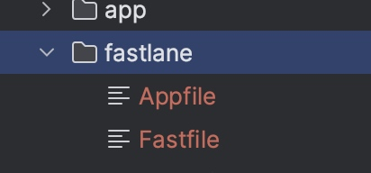
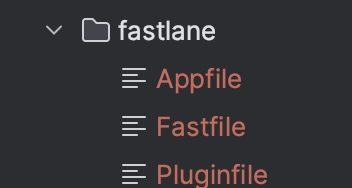
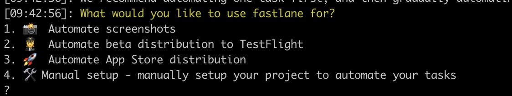

# Fastlane在Flutter中打包并上传分发平台的实践

## 本地环境：

```
fastlane： 2.216.0
Flutter：
 (Channel stable, 3.10.0, on macOS 13.2 22D49 darwin-arm64, locale
    zh-Hans-CN)
Android toolchain - develop for Android devices (Android SDK version
    32.1.0-rc1)
Xcode - develop for iOS and macOS (Xcode 14.1)
```

>以下是本地环境的实践内容，分发平台以蒲公英为例。

## 环境搭建
* 安装fastlane cli

```
 MacOS： `brew install fastlane`
 macOS/Linux/Windows： sudo gem install fastlane
```

## 配置
> 在具体项目中进行Fastlane的初始化配置

### Android

* 1. cd 到某Flutter项目下的/android目录，执行`fastlane init`
* 2. `init`过程中会需要输入包名，剩下的就直接回车即可。
* 3. init 成功后会在android目录下生成`fastlane`文件夹

* 4. 引入蒲公英的插件：在/android 目录下执行`fastlane add_plugin pgyer`
* 5. 4执行成功后，会在fastlane文件下下生成一个`Pluginfile`


### iOS

* 1.  cd 到某Flutter项目下的/ios目录，执行`fastlane init`
* 2. 执行过程会让你选择action的配置，根据自己需要按数字选择


* 3. init 成功后会在ios目录下生成`fastlane`文件夹
* 4. 引入蒲公英的插件：在/android 目录下执行`fastlane add_plugin pgyer`

## 打包发布

### Android

* 1. 修改/android/fastlane/Fastfile文件

```ruby
# This file contains the fastlane.tools configuration
# You can find the documentation at https://docs.fastlane.tools
#
# For a list of all available actions, check out
#
#     https://docs.fastlane.tools/actions
#
# For a list of all available plugins, check out
#
#     https://docs.fastlane.tools/plugins/available-plugins
#

# Uncomment the line if you want fastlane to automatically update itself
# update_fastlane

default_platform(:android)

platform :android do
  desc "Runs all the tests"
  lane :test do
    gradle(task: "test")
  end

  desc "Submit a new Beta Build to Crashlytics Beta"
  lane :beta do
    gradle(task: "clean assembleRelease")
    crashlytics
  
    # sh "your_script.sh"
    # You can also use other beta testing services here
  end

  desc "Deploy a new version to the Google Play"
  lane :deploy do
    gradle(task: "clean assembleRelease")
    upload_to_play_store
  end
  lane :deployPgyer do
    gradle(task: "clean assembleRelease")
    notification(app_icon: "./fastlane/icon.png", title: "manager", subtitle: "Android打包成功", message: "准备发布到蒲公英……")
#in the list of available options: api_key, apk, ipa, password, update_description, save_uploaded_info_json, install_type, install_date, install_start_date, install_end_date, oversea, channel
    pgyer(api_key:"your_api_key",apk:"[应用包的绝对路径]")
  end
end

```

* 2. cd到/android目录下执行： `fastlane deployPgyer`

### iOS

* 1. 修改/ios/fastlane/Fastfile文件

```ruby
# This file contains the fastlane.tools configuration
# You can find the documentation at https://docs.fastlane.tools
#
# For a list of all available actions, check out
#
#     https://docs.fastlane.tools/actions
#
# For a list of all available plugins, check out
#
#     https://docs.fastlane.tools/plugins/available-plugins
#

# Uncomment the line if you want fastlane to automatically update itself
# update_fastlane

default_platform(:ios)

platform :ios do
  desc "Description of what the lane does"
  lane :custom_lane do
    # add actions here: https://docs.fastlane.tools/actions
  end

  lane :deployPgyer do
    gym(
    #每次打包之前clean一下
    clean: true,
    output_name: 'xxx.ipa',
    # 默认 Release，Release or Debug
    configuration: 'Release',
    # 打包导出方式，包含 app-store, validation, ad-hoc, package, enterprise, development, developer-id and mac-application
    export_method: 'enterprise',
    # 这个设置是为了设置 xcode 自动配置证书和配置文件，当然也可以手动配置，可以参考文档
    export_xcargs: '-allowProvisioningUpdates'
    )
    # mac上的通知弹窗，通知打包完毕
    notification(app_icon: "./fastlane/icon.png", title: "manager", subtitle: "iOS打包成功", message: "准备发布到蒲公英……")
     pgyer(api_key:"your_api_key",apk:"[应用包的绝对路径]")
  end
end

```

* 2. cd到/ios目录下执行： `fastlane deployPgyer`