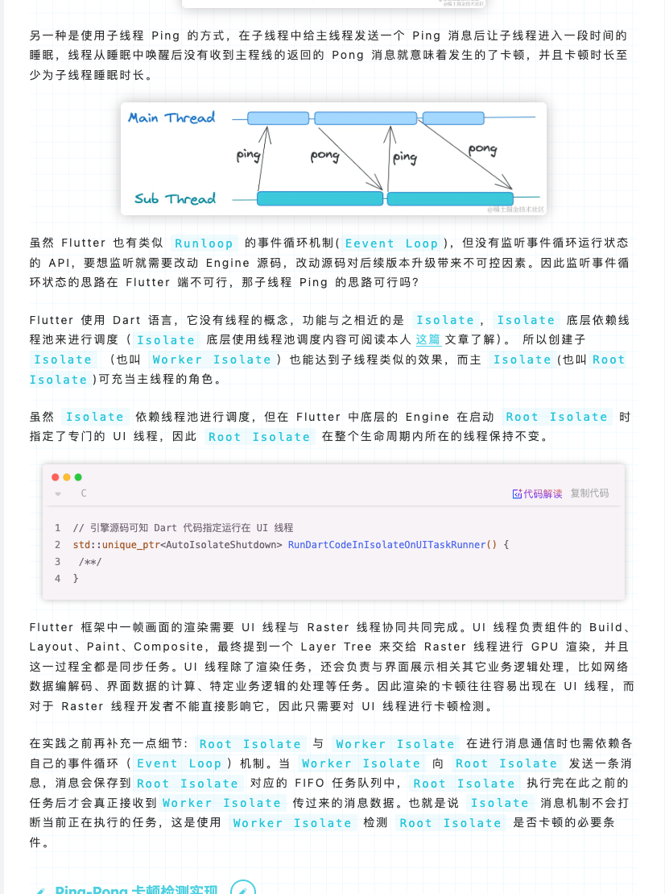

# Flutter 线上环境卡顿监测实践

> 原理和方法来自于 : https://juejin.cn/post/7390620343014096948


> 原理: 利用Flutter Isolate线程池调度的底层逻辑, 创建一个工作线程`worker isolate`, (即子线程). 利用事件循环机制, 让子线程发送一个消息给主线程后进入一段时间睡眠, 睡眠周期结束后如果没有收到主线程回复的消息, 则可以认为发送了卡顿

原文逻辑如图: 




## iOS实践


> *卡顿监测主要做2件事情:* 
>
> 1是监测卡顿;  
>
> 2是还原卡顿时的堆栈信息


 监测核心逻辑:

```dart
class PerfFreezeMonitor {
  static PerfFreezeMonitor? _instance;
  PerfFreezeMonitor._();
  factory PerfFreezeMonitor() => _instance ??= PerfFreezeMonitor._();

  Isolate? _workerIsolate;

  ReceivePort? _mainReceivePort;


  void startMonitor({Duration sampling = const Duration(milliseconds: 25)}) async {
    if (_mainReceivePort != null || _workerIsolate != null) return;
    
    _mainReceivePort = ReceivePort();

    _workerIsolate = await Isolate.spawn(_workerIsolateFun, _mainReceivePort!.sendPort);

    SendPort? workerSendPort;
    
		/// 主线程监听
    _mainReceivePort!.listen((data){
      if (data is SendPort) {
        workerSendPort  = data;
        return;
      }
      if (data is int && identical(data, ping)) {
        /// 接收到工作线程发送的'ping',就回复'pong'
        workerSendPort?.send(pong);
        return;
      }
    });
  }

  void stopMonitor() {
    _mainReceivePort?.close();
    _mainReceivePort = null;
    _workerIsolate?.kill(priority: Isolate.immediate);
    _workerIsolate = null;
  }

}

void _workerIsolateFun(SendPort workerSendPort)  async {
  final workerReceivePort = ReceivePort();
  workerSendPort.send(workerReceivePort.sendPort);

  late Completer syncCompleter; 
	/// 工作线程监听
  workerReceivePort.listen((p) {
    if (p is int && identical(p, pong)) {
      syncCompleter.complete();
    }
  });

 
  
  while (true) {
    syncCompleter = Completer();
    workerSendPort.send(ping);
    /// 发送ping后休眠一个监测周期
    await Future.delayed(const Duration(milliseconds: 25));
    if (!syncCompleter.isCompleted) {
      /// 从休眠恢复后没有收到pong回复则认为卡顿
      print('卡顿了');
      await syncCompleter.future;
    }
  }
}
```


- 创建一个Flutter plugin 工程

  ```
  flutter create --org com.example --template=plugin --platforms=android,ios -a java hello
  ```

- 添加依赖

  ```
  dependencies:
    # 原生交互
  	ffi:
  	# 地址抹平平台差异
    path: ^1.9.0
  dev_dependencies:
  	ffigen:
  	
  ffigen:
    description: '卡顿检测'
    output: './lib/generated_bindings.dart'
    headers:
      entry-points:
        - 'ios/Classes/ui_thread_stacktrace.h'
      include-directives: 
        - 'ios/Classes/ui_thread_stacktrace.h'
    llvm-path:
      - '/Applications/Xcode.app/Contents/Developer/Toolchains/XcodeDefault.xctoolchain/usr/lib/libclang.dylib'
    name: 'NativePerfFreezeMonitor'
  ```

  

- `ui_thread_stacktrace`是用于获取线程状态并回溯堆栈的具体实现, 我们将具体实现放在`./ios/Classes`

  

  ```
  ├── symbolicate.c
  ├── symbolicate.h
  ├── ui_thread_stacktrace.c
  └── ui_thread_stacktrace.h
  ```

-  在podspec中将文件路径引入

  

  ```
   	s.homepage         = 'http://example.com'
    s.license          = { :file => '../LICENSE' }
    s.author           = { 'Your Company' => 'email@example.com' }
    s.source           = { :path => '.' }
    s.source_files = 'Classes/**/*'
    s.public_header_files = 'Classes/**/*.h'
    s.dependency 'Flutter'
    s.frameworks = 'Foundation'
    s.libraries = 'c++', 'z'
    s.platform = :ios, '12.0'
  ```

  

- 运行`dart run ffigen` 生成 `c to dart ffi` 的dart文件,生成文件目录在`pubspec`中配置

- 下载 `llvm` : `xcode-select --install`

- xcode运行app, 触发卡顿,产生如下日志:

  ```
  2024-07-18 16:07:46.610804+0800 Runner[2894:2474101] flutter: 卡顿了
  2024-07-18 16:07:46.610924+0800 Runner[2894:2474101] flutter: [{"imageName":"App","imageHeaderAddress":"108800000","symbolName":"kDartIsolateSnapshotInstructions","symbolAddress":"1088127c0","stackAddress":"108818614","vmStart":"108808000","isolateStart":"1088127c0"},{"imageName":"App","imageHeaderAddress":"108800000","symbolName":"kDartIsolateSnapshotInstructions","symbolAddress":"1088127c0","stackAddress":"1088185d4","vmStart":"108808000","isolateStart":"1088127c0"},{"imageName":"App","imageHeaderAddress":"108800000","symbolName":"kDartIsolateSnapshotInstructions","symbolAddress":"1088127c0","stackAddress":"10893dd1c","vmStart":"108808000","isolateStart":"1088127c0"},{"imageName":"App","imageHeaderAddress":"108800000","symbolName":"kDartIsolateSnapshotInstructions","symbolAddress":"1088127c0","stackAddress":"1088daeec","vmStart":"108808000","isolateStart":"1088127c0"},{"imageName":"App","imageHeaderAddress":"108800000
  ...
  
  
  ```

接下来需要将日志中的内存地址转成可读的代码信息, 可以利用符号表, 用`native_stack_traces`符号化解析工具进行解析

- 存储符号表

```
flutter build ipa --export-method enterprise --split-debug-info=./symbol_file/
```

生成的目录如图:

```
symbol_file 
└── app.ios-arm64.symbols
```

- 下载``native_stack_traces``

```
dart pub global activate native_stack_traces
```

- 我本地的地址为: `.pub-cache/bin/decode` 

  ```
   ~ .pub-cache/bin/decode -h
  Usage: decode <command> [options] ...
  
  Commands:
  dump
  help
  find
  translate
  
  Options shared by all commands:
  -h, --help    Print usage information for this or a particular subcommand
  ```

- 按「行」进行符号化解析使用 `find` 命令，通过指定下面四个参数，即可完成符号化解析。

  - `isolate_start`：Dart 代码段开始地址
  - `vm_start`：     VM 代码段开始地址
  - `l`：            堆栈地址
  - `d`：            符号表文件
  - `a`：CPU 架构

  

  比如这一条数据: `{"imageName":"App","imageHeaderAddress":"108800000","symbolName":"kDartIsolateSnapshotInstructions","symbolAddress":"1088127c0","stackAddress":"108818614","vmStart":"108808000","isolateStart":"1088127c0"}`, 可以单条解析如下: 

  ```
  .pub-cache/bin/decode  find -d /xxx/symbol_file/app.ios-arm64.symbols \
  -a x64 \
  --isolate_start 0x1088127c0 \
  --vm_start 0x108808000 \
  -l 0x108818614
  ```

  

  解析结果为: 

  ```
  For virtual address 0x1d0614:
    log (third_party/dart/sdk/lib/_internal/vm/lib/math_patch.dart)
    _MyHomePageState._incrementCounter (/xxx/example/lib/main.dart:59:17)
  ```

  

至此, 符号化解析已经在本地跑通


